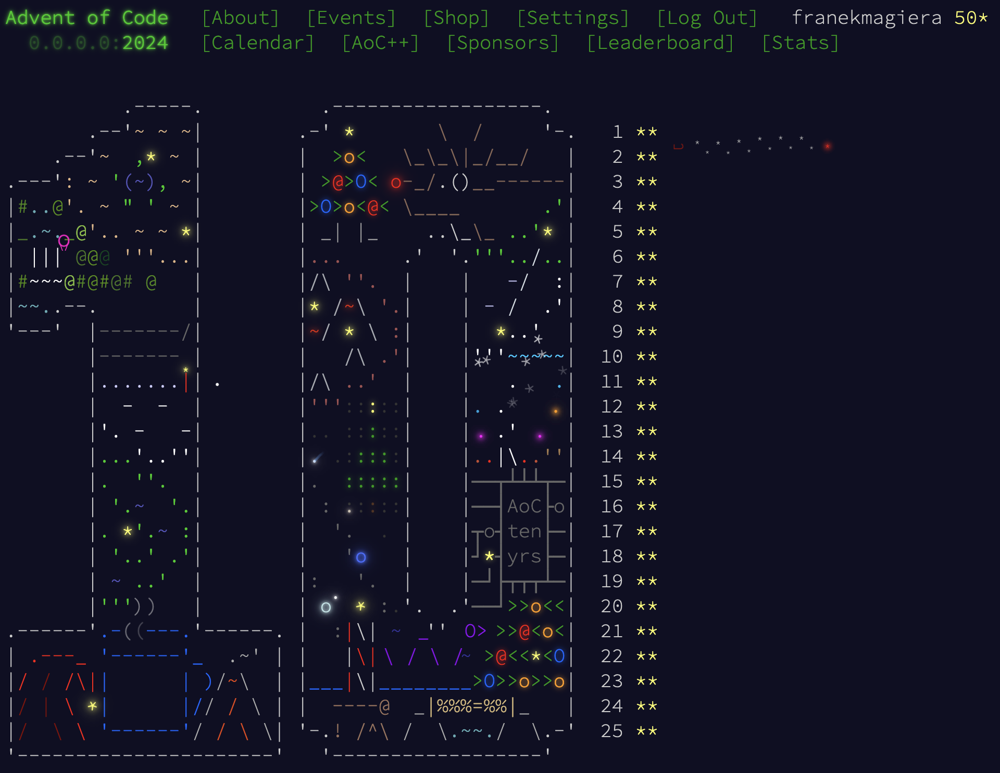

# Advent of Code 2024
My solutions for [AoC 2024](https://adventofcode.com/2024). Most of them are not the best examples of "clean, understandable code", but the goal for me this year is to (1) just complete the puzzles and (2) have fun doing that! Some of the puzzles I did semi-manually (Day 17 and 18). Managed to get all 50 stars:

I needed hints for:
- Day 12
- Day 14
- Day 21
